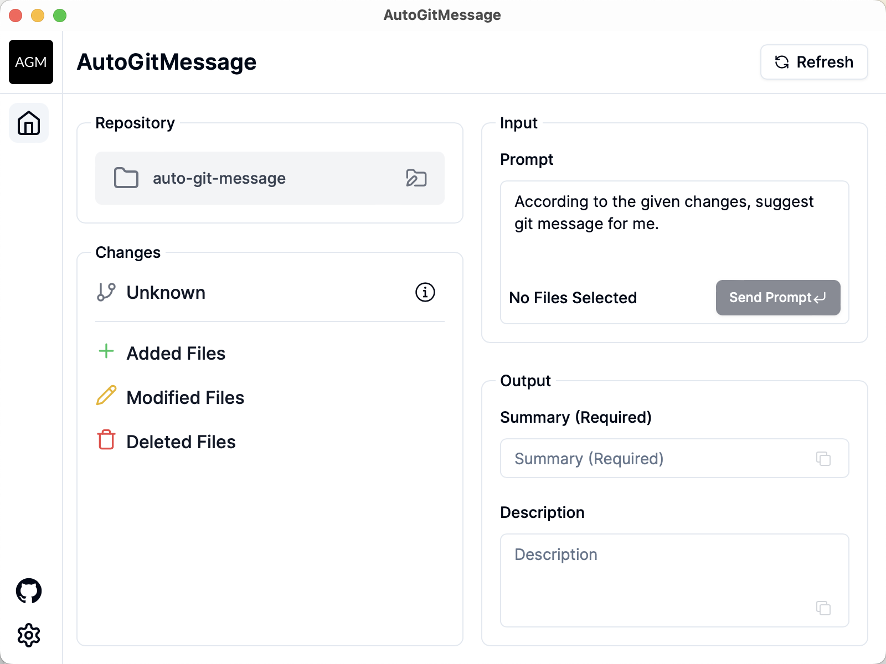

# AutoGitMessage

AutoGitMessage is a TypeScript-based full-stack application designed to streamline the process of generating commit messages. It reads code changes in a Git project, generates diffs, and utilizes AI to automatically write meaningful and contextually appropriate Git commit messages.

## Features

- **Automated Diff Generation**: Reads the code changes in your Git repository and generates diffs.
- **AI-Powered Commit Messages**: Uses AI to analyze diffs and generate relevant commit messages.
- **TypeScript Full-Stack**: Built using TypeScript for both the front-end and back-end.
- **Easy Integration**: Can be integrated into your existing Git workflow seamlessly.

## Screenshots

### Screenshot

## License

This project is licensed under the MIT License. See the [LICENSE](LICENSE) file for details.